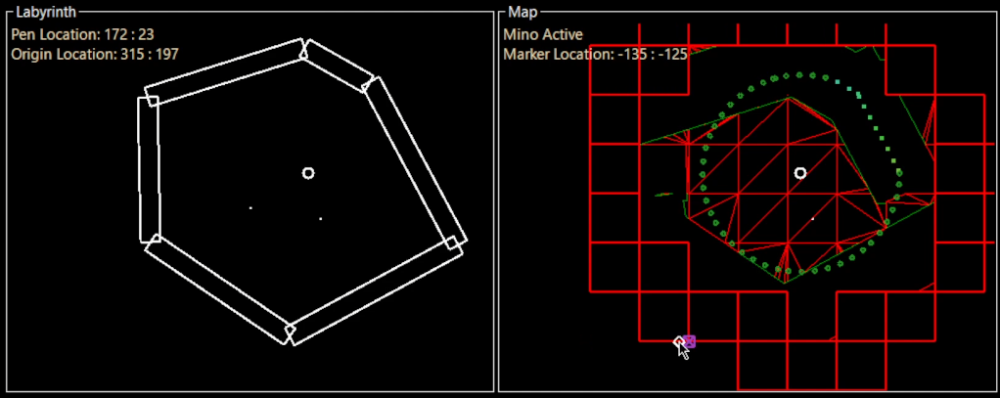
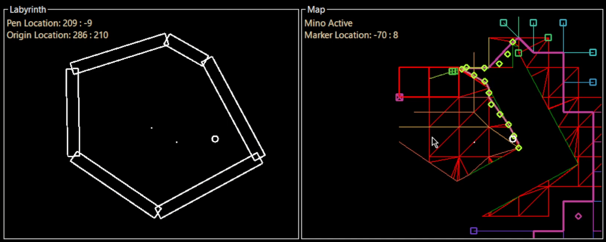
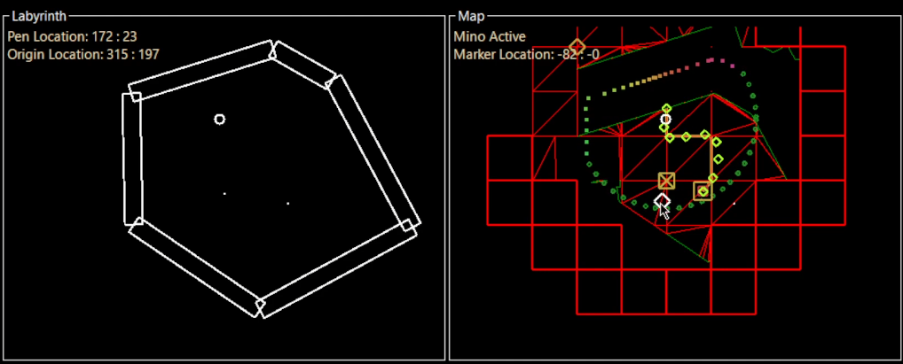

# Daedalus
Created By: Ian R. Poll, Fillip L. Cannard, James P. Clark, Sophia A. Rodriguez, Mohammed Hani Shaik, Veerain Arya Manchikanti
---

## Summary
This applicaiton is an exploration and navigation simulation for a rumba-like robot (minotaur). The user draws a labyrinth and sets a target point for the minotaur to navigate to in a 2D environment. It primarily uses a* pathfinding to navigate to a specified target or roam and explore the drawn map depending on the selected mode.

## Examples

*Minotaur cannot reach target*

*Minotaur roams and explores the map with no specified target*

*Minotaur goes to the target while avoiding obstacles*

## Additional Libraries Used
- [earclipper](https://github.com/NMO13/earclipper)
- [Clipper2](https://github.com/AngusJohnson/Clipper2)
- [pathfinding](https://github.com/SebLague/Pathfinding)
*Developed in C# using Visual Studio*
